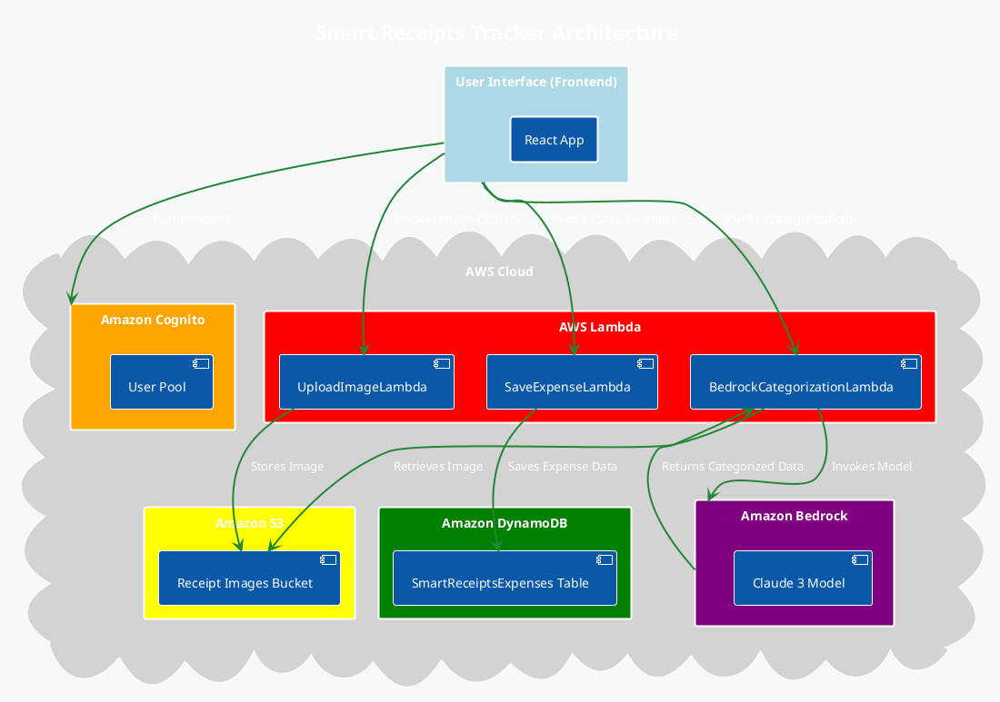

# Commands and Code Changes from Chat History

This document contains a summary of the commands executed and code changes made during the chat session.

---

## 1. Frontend CSS Fix: @import Order

**Problem:** `[vite:css] @import must precede all other statements` error in `frontend/src/index.css`.

**Action:** Moved the `@import url(...)` statement to the top of `frontend/src/index.css`.

**Code Change (frontend/src/index.css):**
```css
@import url('https://fonts.googleapis.com/css2?family=Inter:wght@400;500;600;700;800&display=swap');

@tailwind base;
@tailwind components;
@tailwind utilities;

* {
  font-family: 'Inter', system-ui, -apple-system, sans-serif;
}

/* ... rest of the CSS ... */
```

---

## 2. Architecture Update and Diagram

**Request:** Simplify architecture to use Cognito, DynamoDB, S3, Lambda (no API Gateway, no Step Functions). Direct Lambda calls from UI. Add architecture diagram to `architecture.md`.

**Action:** Updated `architecture.md` content and added a PlantUML diagram.

**PlantUML Diagram Code (in architecture.md):**


---

## 3. Cognito Authentication Setup (Frontend)

**Request:** Implement Cognito user authentication/authorization via email and password using Cognito SDK (not Amplify).

**Actions:**
- Installed AWS SDK for Cognito Identity Provider.
- Modified `frontend/src/utils/auth.ts` to use Cognito SDK.
- Updated `frontend/src/components/AuthModal.tsx` to integrate Cognito functions.
- Updated `frontend/src/components/LandingPage.tsx` to use `AuthModal`.
- Updated `frontend/src/App.tsx` to manage authentication state.
- Added `getCurrentUser` and `signOutUser` to `frontend/src/utils/auth.ts`.

**CLI Commands:**
```bash
npm install @aws-sdk/client-cognito-identity-provider @aws-sdk/credential-provider-cognito-identity --prefix frontend
```

**Code Changes (frontend/src/utils/auth.ts - key parts):**
```typescript
import {
  CognitoIdentityProviderClient,
  InitiateAuthCommand,
  SignUpCommand,
  AuthFlowType,
  ConfirmSignUpCommand,
  GetUserCommand,
  GlobalSignOutCommand,
} from "@aws-sdk/client-cognito-identity-provider";

const USER_POOL_ID = import.meta.env.VITE_APP_COGNITO_USER_POOL_ID;
const CLIENT_ID = import.meta.env.VITE_APP_COGNITO_CLIENT_ID;
const REGION = import.meta.env.VITE_APP_AWS_REGION;

// ... authenticateUser, registerUser, confirmUserRegistration, getCurrentUser, signOutUser implementations ...
```

---

## 4. AWS Cognito Pool and Client Creation

**Request:** Create Cognito User Pool and App Client via CLI, store details in `.env`.

**CLI Commands:**
```bash
aws cognito-idp create-user-pool \
    --pool-name SmartReceiptsUserPool \
    --auto-verified-attributes email \
    --policies "PasswordPolicy={MinimumLength=8,RequireUppercase=true,RequireLowercase=true,RequireNumbers=true,RequireSymbols=false}" \
    --schema "Name=email,AttributeDataType=String,Mutable=true,Required=true" "Name=name,AttributeDataType=String,Mutable=true,Required=false"

# (Note down User Pool ID from output, e.g., us-east-1_LUsEaQPKj)

aws cognito-idp create-user-pool-client \
    --user-pool-id us-east-1_LUsEaQPKj \
    --client-name SmartReceiptsAppClient \
    --no-generate-secret \
    --explicit-auth-flows ADMIN_NO_SRP_AUTH USER_PASSWORD_AUTH

# (Note down ClientId from output, e.g., 39i6ediqf3h77go7j2l4eha7tp)
```

**`.env` File Creation (frontend/.env):**
```
VITE_APP_COGNITO_USER_POOL_ID="us-east-1_LUsEaQPKj"
VITE_APP_COGNITO_CLIENT_ID="39i6ediqf3h77go7j2l4eha7tp"
VITE_APP_AWS_REGION="us-east-1"
```

---

## 5. Image Upload, Bedrock Processing, and Expense Saving (Backend & Frontend)

**Request:** Implement end-to-end flow: User uploads image -> Lambda stores in S3 -> Bedrock Lambda extracts data -> UI displays data -> User saves -> Lambda saves to DynamoDB.

**Actions:**
- Created S3 bucket.
- Created IAM role for Lambdas with necessary permissions.
- Created DynamoDB table.
- Created and deployed `UploadImageLambda` (Python).
- Created and deployed `BedrockCategorizationLambda` (Python).
- Created and deployed `SaveExpenseLambda` (Python).
- Created `frontend/src/utils/lambda.ts` for generic Lambda invocation.
- Installed `@aws-sdk/client-lambda`.
- Updated `frontend/src/components/UploadCard.tsx` to call `UploadImageLambda` and `BedrockCategorizationLambda`.
- Updated `frontend/src/components/UploadFlow.tsx` to display extracted data and call `SaveExpenseLambda`.
- Updated `frontend/src/App.tsx` to orchestrate the flow.
- Updated `frontend/src/types/expense.ts` to include `s3Key` in `UploadState`.

**CLI Commands:**
```bash
# S3 Bucket Creation (replace 'your-unique-id' with a unique identifier)
aws s3api create-bucket --bucket smart-receipts-images-your-unique-id --region us-east-1

# IAM Role Creation
aws iam create-role --role-name SmartReceiptsLambdaRole --assume-role-policy-document '{"Version":"2012-10-17","Statement":[{"Effect":"Allow","Principal":{"Service":"lambda.amazonaws.com"},"Action":"sts:AssumeRole"}]}' --description "IAM role for Smart Receipts Lambda functions with S3, Bedrock, and DynamoDB access."

# Attach Managed Policies to IAM Role
aws iam attach-role-policy --role-name SmartReceiptsLambdaRole --policy-arn arn:aws:iam::aws:policy/AmazonBedrockFullAccess
aws iam attach-role-policy --role-name SmartReceiptsLambdaRole --policy-arn arn:aws:iam::aws:policy/service-role/AWSLambdaBasicExecutionRole

# Attach Inline Policy for S3 and DynamoDB to IAM Role (replace 'smart-receipts-images-your-unique-id' and 'us-east-1' if different)
aws iam put-role-policy --role-name SmartReceiptsLambdaRole --policy-name S3DynamoDBAccessPolicy --policy-document '{"Version":"2012-10-17","Statement":[{"Effect":"Allow","Action":["s3:PutObject","s3:GetObject"],"Resource":"arn:aws:s3:::smart-receipts-images-your-unique-id/*"},{"Effect":"Allow","Action":["dynamodb:PutItem","dynamodb:GetItem","dynamodb:UpdateItem"],"Resource":"arn:aws:dynamodb:us-east-1:442042523577:table/SmartReceiptsExpenses"}]}'

# DynamoDB Table Creation (replace 'us-east-1' if different)
aws dynamodb create-table --table-name SmartReceiptsExpenses --attribute-definitions AttributeName=userId,AttributeType=S AttributeName=expenseId,AttributeType=S --key-schema AttributeName=userId,KeyType=HASH AttributeName=expenseId,KeyType=RANGE --provisioned-throughput ReadCapacityUnits=5,WriteCapacityUnits=5 --region us-east-1

# Wait for DynamoDB table to be active
aws dynamodb wait table-exists --table-name SmartReceiptsExpenses --region us-east-1

# Lambda Deployment (from backend directory)
# Package UploadImageLambda
cd backend && zip upload_image_lambda.zip upload_image_lambda.py
# Create UploadImageLambda (replace 'smart-receipts-images-your-unique-id' and 'us-east-1' if different)
aws lambda create-function --function-name UploadImageLambda --runtime python3.9 --handler upload_image_lambda.lambda_handler --role arn:aws:iam::442042523577:role/SmartReceiptsLambdaRole --zip-file fileb://backend/upload_image_lambda.zip --environment Variables={S3_BUCKET_NAME=smart-receipts-images-your-unique-id} --timeout 30 --memory-size 128

# Package BedrockCategorizationLambda
cd backend && zip bedrock_categorization_lambda.zip bedrock_categorization_lambda.py
# Create BedrockCategorizationLambda (replace 'smart-receipts-images-your-unique-id' and 'us-east-1' if different)
aws lambda create-function --function-name BedrockCategorizationLambda --runtime python3.9 --handler bedrock_categorization_lambda.lambda_handler --role arn:aws:iam::442042523577:role/SmartReceiptsLambdaRole --zip-file fileb://backend/bedrock_categorization_lambda.zip --environment Variables={S3_BUCKET_NAME=smart-receipts-images-your-unique-id} --timeout 60 --memory-size 512

# Package SaveExpenseLambda
cd backend && zip save_expense_lambda.zip save_expense_lambda.py
# Create SaveExpenseLambda (replace 'us-east-1' if different)
aws lambda create-function --function-name SaveExpenseLambda --runtime python3.9 --handler save_expense_lambda.lambda_handler --role arn:aws:iam::442042523577:role/SmartReceiptsLambdaRole --zip-file fileb://backend/save_expense_lambda.zip --environment Variables={DYNAMODB_TABLE_NAME=SmartReceiptsExpenses} --timeout 30 --memory-size 128

# Frontend Lambda SDK Installation (from frontend directory)
npm install @aws-sdk/client-lambda --prefix frontend
```

**Python Lambda Code (backend/upload_image_lambda.py):**
```python
import json
import base64
import os
import uuid
import boto3

s3_client = boto3.client('s3')

S3_BUCKET_NAME = os.environ.get('S3_BUCKET_NAME')

def lambda_handler(event, context):
    try:
        body = json.loads(event['body'])
        image_data_base64 = body['image_data']
        file_name = body.get('file_name', str(uuid.uuid4()) + '.jpg')

        # Decode the base64 image data
        image_bytes = base64.b64decode(image_data_base64)

        # Generate a unique key for S3
        s3_key = f"receipts/{file_name}"

        # Upload image to S3
        s3_client.put_object(
            Bucket=S3_BUCKET_NAME,
            Key=s3_key,
            Body=image_bytes,
            ContentType='image/jpeg' # Assuming JPEG, adjust if other types are supported
        )

        s3_url = f"https://{S3_BUCKET_NAME}.s3.amazonaws.com/{s3_key}"

        return {
            'statusCode': 200,
            'body': json.dumps({
                'message': 'Image uploaded successfully',
                's3_key': s3_key,
                's3_url': s3_url
            })
        }
    except KeyError as e:
        return {
            'statusCode': 400,
            'body': json.dumps({'error': f'Missing key in request body: {e}'})
        }
    except Exception as e:
        return {
            'statusCode': 500,
            'body': json.dumps({'error': str(e)})
        }
```

**Python Lambda Code (backend/bedrock_categorization_lambda.py):**
```python
import json
import os
import boto3
import base64

s3_client = boto3.client('s3')
bedrock_runtime = boto3.client('bedrock-runtime')

S3_BUCKET_NAME = os.environ.get('S3_BUCKET_NAME')

def get_image_from_s3(s3_key):
    try:
        response = s3_client.get_object(Bucket=S3_BUCKET_NAME, Key=s3_key)
        image_bytes = response['Body'].read()
        return base64.b64encode(image_bytes).decode('utf-8')
    except Exception as e:
        print(f"Error getting image from S3: {e}")
        return None

def invoke_bedrock_model(image_base64):
    try:
        # Define the prompt for Bedrock to extract information
        prompt = "Extract the vendor name, amount, category (e.g., Food, Transport, Utilities, Entertainment, Groceries, Shopping, Health, Education, Travel, Other), description, and date from this receipt image. If any information is missing or unreadable, use 'Not Applicable'. Provide the output in a JSON format with keys: vendor, amount, category, description, date."

        body = json.dumps({
            "anthropic_version": "bedrock-2023-05-31",
            "max_tokens": 2000,
            "messages": [
                {
                    "role": "user",
                    "content": [
                        {
                            "type": "image",
                            "source": {
                                "type": "base64",
                                "media_type": "image/jpeg", # Assuming JPEG, adjust if other types are supported
                                "data": image_base64
                            }
                        },
                        {
                            "type": "text",
                            "text": prompt
                        }
                    ]
                }
            ]
        })

        response = bedrock_runtime.invoke_model(
            body=body,
            modelId="anthropic.claude-3-sonnet-20240229", # Using Sonnet for better extraction, can be changed to Haiku
            accept='application/json',
            contentType='application/json'
        )

        response_body = json.loads(response.get('body').read())
        # Extract the text content from the response
        bedrock_output = response_body['content'][0]['text']

        # Attempt to parse the JSON output from Bedrock
        try:
            extracted_data = json.loads(bedrock_output)
        except json.JSONDecodeError:
            print(f"Bedrock output is not valid JSON: {bedrock_output}")
            extracted_data = {
                "vendor": "Not Applicable",
                "amount": "Not Applicable",
                "category": "Not Applicable",
                "description": "Not Applicable",
                "date": "Not Applicable"
            }

        return extracted_data

    except Exception as e:
        print(f"Error invoking Bedrock model: {e}")
        return {
            "vendor": "Not Applicable",
            "amount": "Not Applicable",
            "category": "Not Applicable",
            "description": "Not Applicable",
            "date": "Not Applicable"
        }

def lambda_handler(event, context):
    try:
        body = json.loads(event['body'])
        s3_key = body['s3_key']

        image_base64 = get_image_from_s3(s3_key)
        if not image_base64:
            return {
                'statusCode': 500,
                'body': json.dumps({'error': 'Could not retrieve image from S3.'})
            }

        extracted_data = invoke_bedrock_model(image_base64)

        return {
            'statusCode': 200,
            'body': json.dumps({
                'message': 'Data extracted successfully',
                'extracted_data': extracted_data
            })
        }
    except KeyError as e:
        return {
            'statusCode': 400,
            'body': json.dumps({'error': f'Missing key in request body: {e}'})
        }
    except Exception as e:
        return {
            'statusCode': 500,
            'body': json.dumps({'error': str(e)})
        }
```

**Python Lambda Code (backend/save_expense_lambda.py):**
```python
import json
import os
import boto3
import uuid

dynamodb = boto3.resource('dynamodb')

TABLE_NAME = os.environ.get('DYNAMODB_TABLE_NAME')

def lambda_handler(event, context):
    try:
        body = json.loads(event['body'])
        
        user_id = body.get('userId')
        vendor = body.get('vendor', 'Not Applicable')
        amount = body.get('amount', 'Not Applicable')
        category = body.get('category', 'Not Applicable')
        description = body.get('description', 'Not Applicable')
        date = body.get('date', 'Not Applicable')
        s3_key = body.get('s3_key', None)

        if not user_id:
            return {
                'statusCode': 400,
                'body': json.dumps({'error': 'userId is required.'})
            }

        table = dynamodb.Table(TABLE_NAME)
        
        expense_id = str(uuid.uuid4())
        
        item = {
            'userId': user_id,
            'expenseId': expense_id,
            'vendor': vendor,
            'amount': amount,
            'category': category,
            'description': description,
            'date': date,
            'createdAt': json.dumps(context.get_remaining_time_in_millis()), # Placeholder for actual timestamp
        }
        
        if s3_key:
            item['s3_key'] = s3_key

        table.put_item(Item=item)

        return {
            'statusCode': 200,
            'body': json.dumps({
                'message': 'Expense saved successfully',
                'expenseId': expense_id
            })
        }
    except KeyError as e:
        return {
            'statusCode': 400,
            'body': json.dumps({'error': f'Missing key in request body: {e}'})
        }
    except Exception as e:
        return {
            'statusCode': 500,
            'body': json.dumps({'error': str(e)})
        }
```

**TypeScript Code (frontend/src/utils/lambda.ts):**
```typescript
import { LambdaClient, InvokeCommand } from "@aws-sdk/client-lambda";

const REGION = import.meta.env.VITE_APP_AWS_REGION;

const lambdaClient = new LambdaClient({ region: REGION });

export const invokeLambda = async (functionName: string, payload: any): Promise<any> => {
  try {
    const command = new InvokeCommand({
      FunctionName: functionName,
      Payload: JSON.stringify(payload),
    });

    const { Payload } = await lambdaClient.send(command);
    const result = JSON.parse(new TextDecoder("utf-8").decode(Payload));

    if (result.statusCode && result.statusCode !== 200) {
      throw new Error(result.body ? JSON.parse(result.body).error : "Lambda invocation failed");
    }

    return result.body ? JSON.parse(result.body) : result;
  } catch (error) {
    console.error(`Error invoking Lambda function ${functionName}:`, error);
    throw error;
  }
};
```

**TypeScript Code (frontend/src/components/UploadCard.tsx - key parts):**
```typescript
import React, { useState, useRef } from 'react';
import { Camera, Upload, FileText, CheckCircle, Loader } from 'lucide-react';
import { invokeLambda } from '../utils/lambda';

interface UploadCardProps {
  onUpload: (file: File, extractedData: any) => void; // Modified to pass extractedData
  isProcessing?: boolean;
}

export const UploadCard: React.FC<UploadCardProps> = ({ onUpload, isProcessing = false }) => {
  // ... existing state and handlers ...

  const handleFileUpload = async (file: File) => {
    setIsUploading(true);
    try {
      const reader = new FileReader();
      reader.readAsDataURL(file);
      reader.onloadend = async () => {
        const base64data = reader.result?.toString().split(',')[1];

        if (base64data) {
          // 1. Call UploadImageLambda
          const uploadResponse = await invokeLambda('UploadImageLambda', {
            image_data: base64data,
            file_name: file.name,
          });
          const s3Key = uploadResponse.s3_key;

          setIsUploading(false);

          // 2. Call BedrockCategorizationLambda
          const bedrockResponse = await invokeLambda('BedrockCategorizationLambda', {
            s3_key: s3Key,
          });
          const extractedData = bedrockResponse.extracted_data;

          onUpload(file, { ...extractedData, s3_key: s3Key }); // Pass s3_key along with extractedData
        }
      };
      reader.onerror = (error) => {
        console.error("Error reading file:", error);
        setIsUploading(false);
      };
    } catch (error) {
      console.error("Error during upload or Bedrock processing:", error);
      setIsUploading(false);
    }
  };

  // ... rest of the component ...
};
```

**TypeScript Code (frontend/src/components/UploadFlow.tsx - key parts):**
```typescript
import React, { useState, useEffect } from 'react';
import { ArrowLeft, CheckCircle, Edit, Save } from 'lucide-react';
import { Expense } from '../types/expense';
import { categories } from '../utils/mockData';
import { invokeLambda } from '../utils/lambda';

interface UploadFlowProps {
  extractedData: Partial<Expense>;
  onSave: (expense: Expense, file?: File) => void;
  onBack: () => void;
  uploadedFile?: File;
  userId: string;
  s3Key: string; // Add s3Key prop
}

export const UploadFlow: React.FC<UploadFlowProps> = ({ extractedData, onSave, onBack, uploadedFile, userId, s3Key }) => {
  const [formData, setFormData] = useState<Partial<Expense>>({
    vendor: extractedData.vendor || 'Not Applicable',
    amount: extractedData.amount || 'Not Applicable',
    category: extractedData.category || 'Not Applicable',
    description: extractedData.description || 'Not Applicable',
    date: extractedData.date || 'Not Applicable',
  });

  const [isEditing, setIsEditing] = useState(false);
  const [isSaving, setIsSaving] = useState(false);

  useEffect(() => {
    setFormData({
      vendor: extractedData.vendor || 'Not Applicable',
      amount: extractedData.amount || 'Not Applicable',
      category: extractedData.category || 'Not Applicable',
      description: extractedData.description || 'Not Applicable',
      date: extractedData.date || 'Not Applicable',
    });
  }, [extractedData]);

  const handleSave = async () => {
    setIsSaving(true);
    try {
      const expenseToSave = {
        userId: userId,
        vendor: formData.vendor,
        amount: parseFloat(formData.amount as string) || 0,
        category: formData.category,
        description: formData.description,
        date: formData.date,
        s3_key: s3Key, // Pass the S3 key to save with the expense
      };

      await invokeLambda('SaveExpenseLambda', expenseToSave);
      onSave(formData as Expense, uploadedFile);
    } catch (error) {
      console.error("Error saving expense:", error);
      // TODO: Show error message to user
    } finally {
      setIsSaving(false);
    }
  };

  // ... rest of the component ...
};
```

**TypeScript Code (frontend/src/App.tsx - key parts):**
```typescript
import React, { useState, useEffect } from 'react';
// ... other imports ...
import { Expense, UploadState } from './types/expense';
import { User, AuthState } from './types/auth';
import { getCurrentUser, signOutUser } from './utils/auth';
import { saveExpenseToStorage } from './utils/storage';

function App() {
  const [authState, setAuthState] = useState<AuthState>({
    user: null,
    isAuthenticated: false,
    isLoading: true,
  });
  const [showAuthModal, setShowAuthModal] = useState(false);
  const [currentScreen, setCurrentScreen] = useState('dashboard');
  const [uploadState, setUploadState] = useState<UploadState>({
    isUploading: false,
    isProcessing: false,
    s3Key: undefined, // Add s3Key to uploadState
  });
  const [uploadedFile, setUploadedFile] = useState<File | undefined>();

  // ... useEffect for auth session ...
  // ... handleAuthSuccess, handleLogout ...

  const handleUpload = async (file: File, extractedData: any) => {
    setUploadedFile(file);
    setUploadState({
      isUploading: false,
      isProcessing: false,
      extractedData: extractedData,
      s3Key: extractedData.s3_key, // Assuming s3_key is returned in extractedData
    });
    setCurrentScreen('upload-flow');
  };

  const handleSaveExpense = (expense: Expense, file?: File) => {
    if (!authState.user) return;

    const expenseWithUser: Expense = {
      ...expense,
      userId: authState.user.id,
      receiptFile: file,
    };

    saveExpenseToStorage(expenseWithUser);
    setUploadState({ isUploading: false, isProcessing: false, s3Key: undefined });
    setUploadedFile(undefined);
    setCurrentScreen('dashboard');
  };

  // ... handleBackToDashboard ...
  // ... conditional rendering for loading and authentication ...

  const renderCurrentScreen = () => {
    if (!authState.user) return null;

    switch (currentScreen) {
      case 'dashboard':
        return (
          <Dashboard
            onUpload={handleUpload}
            isProcessing={uploadState.isProcessing}
            userId={authState.user.id}
          />
        );
      case 'upload-flow':
        return uploadState.extractedData ? (
          <UploadFlow
            extractedData={uploadState.extractedData}
            onSave={handleSaveExpense}
            onBack={handleBackToDashboard}
            uploadedFile={uploadedFile}
            userId={authState.user.id}
            s3Key={uploadState.s3Key || ''} // Pass s3Key to UploadFlow
          />
        ) : null;
      // ... other cases ...
      default:
        return (
          <Dashboard
            onUpload={handleUpload}
            isProcessing={uploadState.isProcessing}
            userId={authState.user.id}
          />
        );
    }
  };

  return (
    <div className="min-h-screen bg-gradient-to-br from-purple-50 via-white to-purple-50">
      <Header
        currentScreen={currentScreen}
        onScreenChange={setCurrentScreen}
        user={authState.user}
        onLogout={handleLogout}
      />
      <main className="max-w-7xl mx-auto px-4 sm:px-6 lg:px-8 py-8">
        {renderCurrentScreen()}
      </main>
    </div>
  );
}

export default App;
```

**TypeScript Code (frontend/src/types/expense.ts - key parts):**
```typescript
export interface UploadState {
  isUploading: boolean;
  isProcessing: boolean;
  extractedData?: Partial<Expense>;
  s3Key?: string; // Added s3Key
}
```